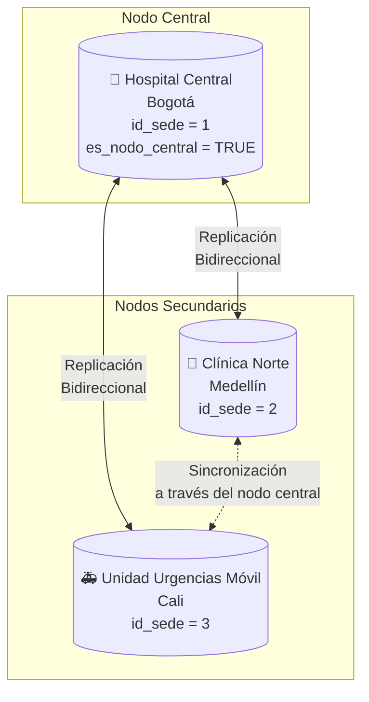
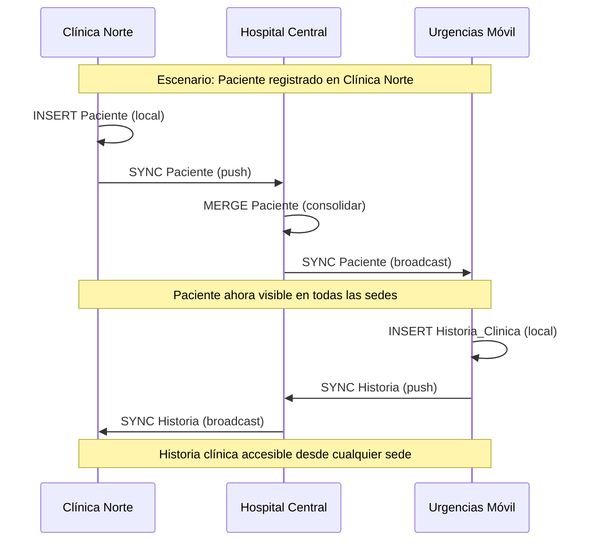

# ESQUEMA DE DISTRIBUCIÓN Y REPLICACIÓN
## Sistema de Gestión Hospitalaria Inteligente (HIS+)

---

## 1. ARQUITECTURA DE LA RED HOSPITALARIA



---

## 2. CLASIFICACIÓN DE TABLAS POR DISTRIBUCIÓN

### 2.1 Tablas LOCALES (Solo en cada sede)
Cada sede mantiene estos datos de forma independiente.

| Tabla | Descripción | Particionamiento |
|-------|-------------|------------------|
| `Citas` | Citas programadas | Por `id_sede` |
| `Equipamiento` | Equipos médicos | Por `id_sede` |
| `Inventario_Farmacia` | Stock de medicamentos | Por `id_sede` |
| `Empleados` | Personal de la sede | Por `id_sede` |
| `Departamentos` | Departamentos locales | Por `id_sede` |
| `Reportes_Generados` | Reportes locales | Por `id_sede` |

### 2.2 Tablas REPLICADAS (Sincronizadas entre sedes)
Estas tablas se replican para garantizar acceso global.

| Tabla | Tipo de Replicación | Justificación |
|-------|---------------------|---------------|
| `Catalogo_Medicamentos` | **Maestro → Réplica** | Catálogo único para toda la red |
| `Historias_Clinicas` | **Bidireccional** | Acceso a historias de cualquier sede |
| `Auditoria_Accesos` | **Maestro → Réplica** | Trazabilidad centralizada |
| `Personas` | **Bidireccional** | Datos compartidos de pacientes/empleados |
| `Pacientes` | **Bidireccional** | Paciente puede atenderse en cualquier sede |
| `Enfermedades` | **Maestro → Réplica** | Catálogo único de diagnósticos |
| `Especialidades` | **Maestro → Réplica** | Catálogo de especialidades |
| `Roles` | **Maestro → Réplica** | Roles uniformes en toda la red |

### 2.3 Tablas GLOBALES (Catálogos compartidos)
Tablas de solo lectura desde el nodo central.

| Tabla | Ubicación | Acceso |
|-------|-----------|--------|
| `Roles` | Nodo Central | Solo lectura en sedes |
| `Especialidades` | Nodo Central | Solo lectura en sedes |
| `Enfermedades` | Nodo Central | Solo lectura en sedes |
| `Catalogo_Medicamentos` | Nodo Central | Solo lectura en sedes |

---

## 3. MAPA DE NODOS

```
┌─────────────────────────────────────────────────────────────────────────┐
│                         RED HOSPITALARIA HIS+                            │
├─────────────────────────────────────────────────────────────────────────┤
│                                                                          │
│  ┌─────────────────────────────────────────────────────────────────┐    │
│  │                    NODO CENTRAL (Hospital Central)               │    │
│  │                         Bogotá - id_sede = 1                     │    │
│  │                                                                  │    │
│  │  TABLAS MAESTRAS:                                                │    │
│  │  • Roles (5 registros)                                           │    │
│  │  • Especialidades (catálogo completo)                            │    │
│  │  • Enfermedades (catálogo completo)                              │    │
│  │  • Catalogo_Medicamentos (catálogo completo)                     │    │
│  │                                                                  │    │
│  │  TABLAS LOCALES + RÉPLICAS:                                      │    │
│  │  • Personas, Pacientes (origen + réplicas)                       │    │
│  │  • Historias_Clinicas (todas las sedes)                          │    │
│  │  • Auditoria_Accesos (consolidado)                               │    │
│  │  • Empleados, Citas, Equipamiento (solo sede 1)                  │    │
│  │  • Inventario_Farmacia (solo sede 1)                             │    │
│  └─────────────────────────────────────────────────────────────────┘    │
│                              │                                           │
│              ┌───────────────┼───────────────┐                          │
│              │               │               │                          │
│              ▼               │               ▼                          │
│  ┌───────────────────┐       │   ┌────────────────────────┐             │
│  │   NODO CLÍNICA    │       │   │  NODO UNIDAD MÓVIL     │             │
│  │      NORTE        │       │   │     URGENCIAS          │             │
│  │  Medellín - id=2  │       │   │   Cali - id=3          │             │
│  │                   │       │   │                        │             │
│  │  LOCAL:           │       │   │  LOCAL:                │             │
│  │  • Empleados_S2   │       │   │  • Empleados_S3        │             │
│  │  • Citas_S2       │       │   │  • Citas_S3            │             │
│  │  • Equipos_S2     │       │   │  • Equipos_S3          │             │
│  │  • Inventario_S2  │       │   │  • Inventario_S3       │             │
│  │                   │       │   │                        │             │
│  │  RÉPLICAS (R/O):  │       │   │  RÉPLICAS (R/O):       │             │
│  │  • Catálogos      │       │   │  • Catálogos           │             │
│  │  • Historias*     │       │   │  • Historias*          │             │
│  │  • Personas*      │       │   │  • Personas*           │             │
│  └───────────────────┘       │   └────────────────────────┘             │
│                              │                                           │
│  * Réplica bidireccional: lectura y escritura local, sincronización     │
│    automática con nodo central                                           │
│                                                                          │
└─────────────────────────────────────────────────────────────────────────┘
```

---

## 4. ESTRATEGIA DE REPLICACIÓN

### 4.1 Replicación Maestro → Réplica (Master-Slave)
- **Dirección**: Nodo Central → Nodos Secundarios
- **Tablas**: Catálogos (Roles, Especialidades, Enfermedades, Catalogo_Medicamentos)
- **Frecuencia**: Inmediata (trigger on INSERT/UPDATE/DELETE)
- **Conflictos**: No hay - solo el nodo central puede modificar

### 4.2 Replicación Bidireccional (Multi-Master)
- **Dirección**: Todas las sedes ↔ Nodo Central
- **Tablas**: Personas, Pacientes, Historias_Clinicas
- **Frecuencia**: Inmediata con cola de sincronización
- **Resolución de conflictos**: 
  - Timestamp wins (última modificación gana)
  - Prioridad del nodo central en empates

### 4.3 Datos Locales (Sin replicación)
- **Tablas**: Citas, Empleados, Equipamiento, Inventario_Farmacia
- **Acceso**: Solo desde la sede propietaria
- **Consultas cruzadas**: A través de vistas distribuidas

---

## 5. VISTAS DISTRIBUIDAS IMPLEMENTADAS

Las siguientes vistas consolidan datos de todas las sedes:

| Vista | Fuente | Propósito |
|-------|--------|-----------|
| `vista_historias_consolidadas` | Historias_Clinicas + Citas + Personas | Historia clínica completa de cualquier paciente |
| `vista_medicamentos_recetados_sede` | Prescripciones + Citas | Medicamentos más recetados por sede |
| `vista_inventario_consolidado` | Inventario_Farmacia + Sedes | Stock de todas las sedes |
| `vista_equipamiento_departamentos` | Equipamiento + Departamentos | Equipos compartidos entre sedes |
| `vista_enfermedades_por_sede` | Diagnostico + Enfermedades + Sedes | Estadísticas por sede |
| `vista_auditoria_historias` | Auditoria_Accesos | Trazabilidad de accesos |

---

## 6. FLUJO DE SINCRONIZACIÓN



---

## 7. PARTICIONAMIENTO POR SEDE

La aplicación Django filtra los datos automáticamente por `id_sede` del usuario logueado:

```python
# Ejemplo de filtrado en views.py
def inventario_farmacia(request):
    user = get_user_from_session(request)
    query = """SELECT * FROM vista_inventario_consolidado 
               WHERE id_sede = %s"""
    inventario = ejecutar_query(query, [user['id_sede']])
```

Este enfoque garantiza:
- Cada sede solo ve sus datos locales por defecto
- Las vistas consolidadas permiten acceso global cuando es necesario
- Seguridad a nivel de fila basada en la sede del usuario

---

## 8. RESUMEN DE DISTRIBUCIÓN

| Sede | ID | Tipo | Datos Locales | Réplicas |
|------|----|----|---------------|----------|
| Hospital Central | 1 | Nodo Central | Todos + Maestros | Recibe de todos |
| Clínica Norte | 2 | Secundario | Empleados, Citas, Equipos, Inventario | Catálogos, Historias |
| Unidad Urgencias | 3 | Secundario | Empleados, Citas, Equipos, Inventario | Catálogos, Historias |
